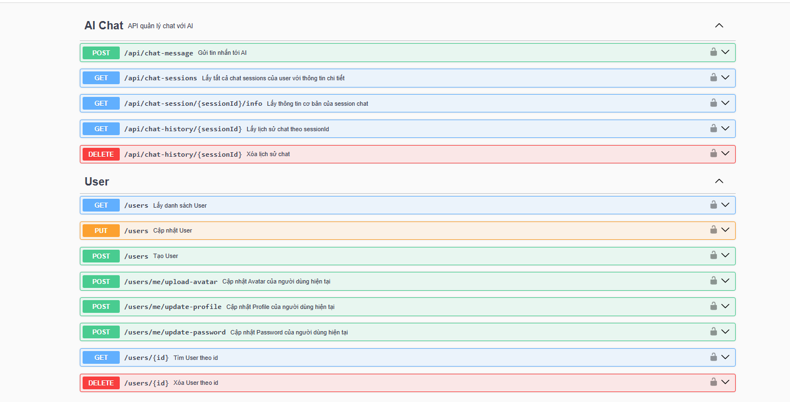
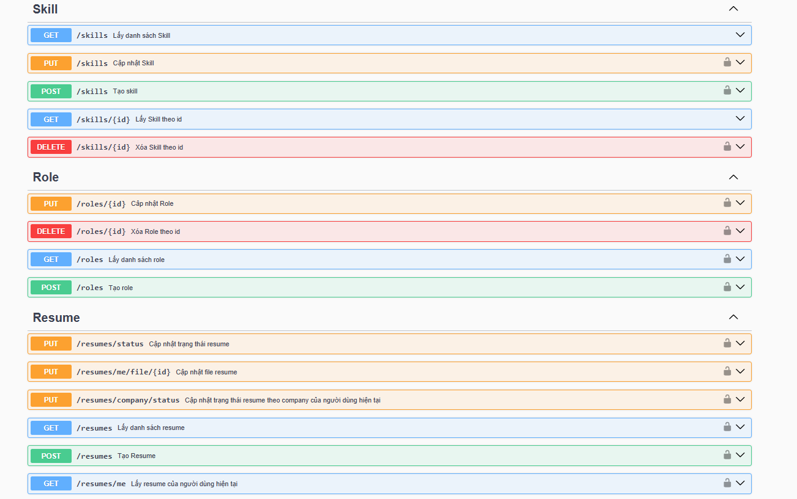
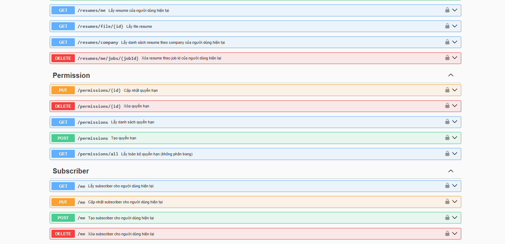
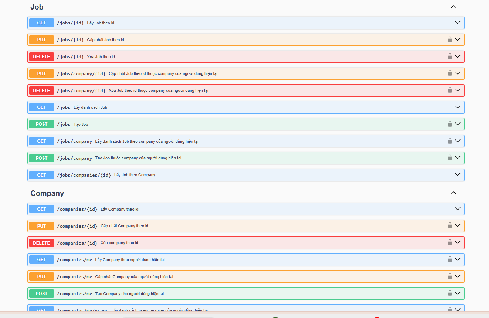

TalentBridge
TalentBridge là nền tảng tuyển dụng thế hệ mới – nơi kết nối nhà tuyển dụng, ứng viên và admin trong một hệ sinh thái tiện lợi, minh bạch và bảo mật. Không chỉ đơn thuần là website tra cứu việc làm, TalentBridge còn giúp tối ưu hóa quy trình tuyển dụng, trải nghiệm người dùng và hiệu quả quản lý cho mọi bên.


👥 3 nhóm người dùng – Mỗi vai trò, mỗi trải nghiệm
1. USER (Ứng viên)
   Tìm kiếm và khám phá chi tiết thông tin công ty, các vị trí tuyển dụng.
   Quản lý hồ sơ cá nhân toàn diện: cập nhật thông tin, đổi avatar, bảo mật tài khoản.
   Chủ động tạo, chỉnh sửa, xoá, tải lên CV – và có thể nộp/rút CV mọi lúc, mọi nơi.
   Đăng ký nhận email job alert siêu cá nhân hoá, tự động gợi ý công việc đúng ngành/nghề, kỹ năng mong muốn.
2. RECRUITER (Nhà tuyển dụng)
   Tự do đăng tin tuyển dụng, quản lý vị trí, chỉnh sửa hoặc ngừng tuyển bất kỳ lúc nào.
   Quản trị thông tin công ty: cập nhật profile, hình ảnh, nội dung giới thiệu.
   Quản lý & lọc ứng viên: duyệt CV, từ chối/nổi bật hồ sơ, xuất báo cáo hiệu quả.
   Mời thêm đồng nghiệp vào đội ngũ, phân quyền từng người theo chức năng tuyển dụng (quản lý tin đăng, duyệt hồ sơ…).
3. ADMIN (Quản trị viên)
   Quản lý toàn bộ hệ thống: duyệt, chỉnh sửa, khóa/xóa mọi loại tài khoản.
   Tạo, chỉnh sửa và phân quyền vai trò cực kỳ chi tiết cho từng tài khoản, nhóm người dùng.
   🚩 Tổng quan công nghệ
   TalentBridge kết hợp sức mạnh của Spring Boot và React

🛠️ Backend
Spring Boot: Trái tim của hệ thống, hơn 60 endpoints “gánh” mọi nghiệp vụ backend.
Spring Security + Oauth2 Resource Server: Xác thực, phân quyền “cứng” bằng JWT, an toàn tuyệt đối.
AWS S3: Lưu trữ ảnh, file; chia folder public/private, presigned url bảo vệ file nhạy cảm (ví dụ: CV).
Redis + Spring Cache: Quản lý refresh_token và link tạm thời, block link hết hạn, giữ dữ liệu luôn riêng tư.
Spring Mail + Thymeleaf: Gửi email tự động, template đẹp, cá nhân hóa nội dung gửi đi.
Cronjob: Gửi email gợi ý việc làm mỗi 8h sáng — luôn giữ kết nối với user.
Swagger: Swagger được cấu hình sẵn trong dự án. Không cần cài thêm, chỉ cần chạy ứng dụng là có thể truy cập tài liệu API. (Khi App khởi động, Swagger sẽ hiện ở: http://localhost:8080/swagger-ui/index.html)










Config S3 Service trên AWS

### Bucket Policy

Thay `bucket-name` bằng tên bucket của bạn.

```json
{
  "Version": "2012-10-17",
  "Statement": [
    {
      "Sid": "Statement1",
      "Effect": "Allow",
      "Principal": "*",
      "Action": "s3:GetObject",
      "Resource": "arn:aws:s3:::bucket-name/public/*"
    },
    {
      "Sid": "Statement2",
      "Effect": "Allow",
      "Principal": "*",
      "Action": "s3:GetObject",
      "Resource": "arn:aws:s3:::bucket-name/company-logos/*"
    },
    {
      "Sid": "Statement3",
      "Effect": "Allow",
      "Principal": "*",
      "Action": "s3:GetObject",
      "Resource": "arn:aws:s3:::bucket-name/avatar/*"
    }
  ]
}
### CORS Configuration

```json
[
  {
    "AllowedHeaders": ["*"],
    "AllowedMethods": ["GET", "HEAD", "PUT", "POST", "DELETE"],
    "AllowedOrigins": ["*"],
    "ExposeHeaders": ["ETag", "Content-Length"]
  }
]
Block public access

Bỏ chọn hai dòng sau:

Block public access to buckets and objects granted through new public bucket or access point policies
Block public and cross-account access to buckets and objects through any public bucket or access point policies
✔ Giữ nguyên hai dòng ACL được check để bảo mật tốt hơn (nếu không dùng ACL).

Config S3 Service trên AWS

### Bucket Policy

Thay `bucket-name` bằng tên bucket của bạn.

```json
{
  "Version": "2012-10-17",
  "Statement": [
    {
      "Sid": "Statement1",
      "Effect": "Allow",
      "Principal": "*",
      "Action": "s3:GetObject",
      "Resource": "arn:aws:s3:::bucket-name/public/*"
    },
    {
      "Sid": "Statement2",
      "Effect": "Allow",
      "Principal": "*",
      "Action": "s3:GetObject",
      "Resource": "arn:aws:s3:::bucket-name/company-logos/*"
    },
    {
      "Sid": "Statement3",
      "Effect": "Allow",
      "Principal": "*",
      "Action": "s3:GetObject",
      "Resource": "arn:aws:s3:::bucket-name/avatar/*"
    }
  ]
}
### CORS Configuration

```json
[
  {
    "AllowedHeaders": ["*"],
    "AllowedMethods": ["GET", "HEAD", "PUT", "POST", "DELETE"],
    "AllowedOrigins": ["*"],
    "ExposeHeaders": ["ETag", "Content-Length"]
  }
]
Block public access

Bỏ chọn hai dòng sau:

Block public access to buckets and objects granted through new public bucket or access point policies
Block public and cross-account access to buckets and objects through any public bucket or access point policies
✔ Giữ nguyên hai dòng ACL được check để bảo mật tốt hơn (nếu không dùng ACL).
